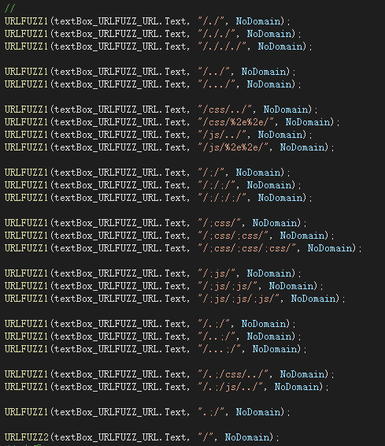

# URLFUZZ
## 0x00 简介

- URLFUZZ 是一款辅助实现**url解析特性造成绕过访问控制**的工具，其能够快速生成用于未授权访问、BypassWAF等测试场景的Payload。

## 0x01 使用说明

- 界面：

- 内置规则展示：

- 自定义规则：勾选Custom Rule可以自定义一条规则

- 使用方法：

- 示例：使用上述保存的字典对http://192.168.10.23/public/upload/files/111.jpg进行URLFUZZ。

